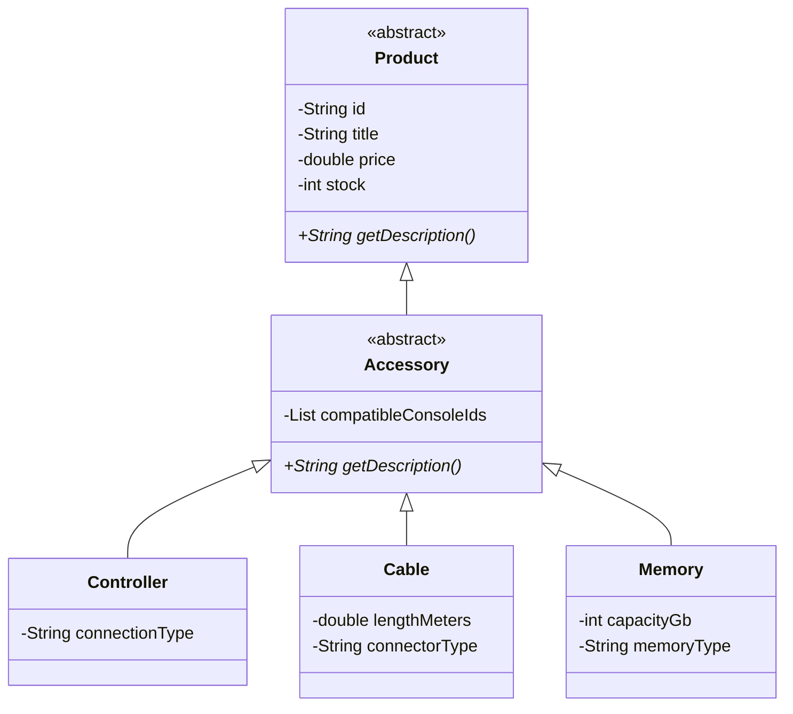

```mermaid
classDiagram
    class Product {
        <<abstract>>
        -String id
        -String title
        -double price
        -int stock
        +String getDescription()*
    }
    class Accessory {
        <<abstract>>
        -List<String> compatibleConsoleIds
        +String getDescription()*
    }
    class Controller {
        -String connectionType
    }
    class Cable {
        -double lengthMeters
        -String connectorType
    }
    class Memory {
        -int capacityGb
        -String memoryType
    }
    Product <|-- Accessory
    Accessory <|-- Controller
    Accessory <|-- Cable
    Accessory <|-- Memory
```
