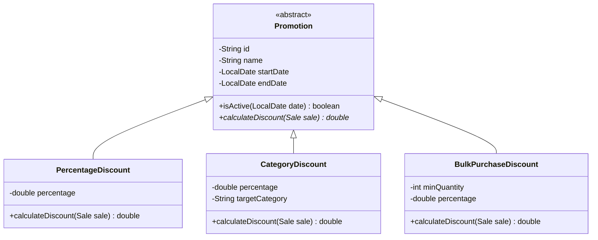

```mermaid
classDiagram
    class Promotion {
        <<abstract>>
        -String id
        -String name
        -LocalDate startDate
        -LocalDate endDate
        +isActive(LocalDate date) boolean
        +calculateDiscount(Sale sale)* double
    }
    class PercentageDiscount {
        -double percentage
        +calculateDiscount(Sale sale) double
    }
    class CategoryDiscount {
        -double percentage
        -String targetCategory
        +calculateDiscount(Sale sale) double
    }
    class BulkPurchaseDiscount {
        -int minQuantity
        -double percentage
        +calculateDiscount(Sale sale) double
    }
    Promotion <|-- PercentageDiscount
    Promotion <|-- CategoryDiscount
    Promotion <|-- BulkPurchaseDiscount
```
